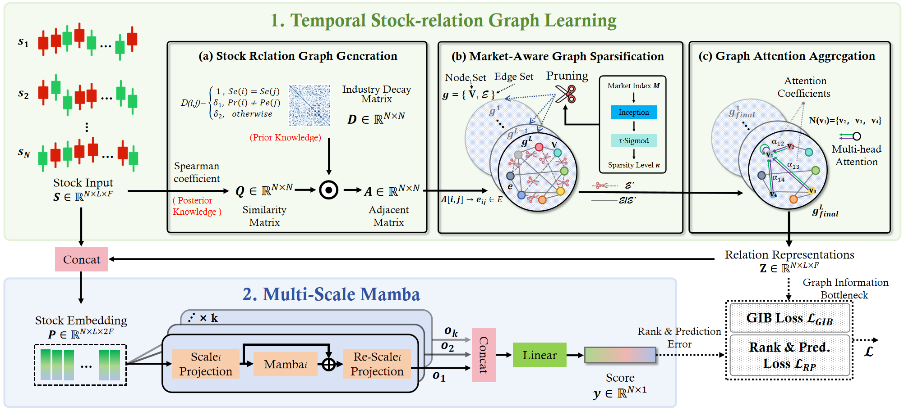

# Readme 
This is the code of **FinMamba**. “Temporal Graph Learning-based Multi-Scale Mamba for Financial Time Series Forecasting”.

StockMamba consists of  Temporal Stock-Correlation Graph learning and Multi-Scale Mamba for stock movement prediction.

## Usage
1. Install dependencies.
- python == 3.8
- torch == 2.0.1
- pandas == 1.5.3
- numpy == 1.23.5

2. Check the provided processed data.

- data/{stock}fea.pkl and data/{stock}lab.pkl are the input features of the stock and the true values of the daily returns to be predicted.
- data/{stock}\_industry\_relationship.npy is the industry decay matrix.
- {stock}\_stock\_relation/{dat}.pkl contains the daily similarity between stocks, which is generated by **genRelation.py**.

3. Run **MambaStock.py**. (For different target set, you could change stock = "nasdaq"/"SP"/"hs"/"zz". The deatialed parameter setting is listed in the "A.4 Implementation Details".)
4. If backtesting is needed, you can run **mambastockTrade.ipynb**.

## Dataset
### Form
The provided data is split into training, validation, and test sets, with 4 stock universes. (CSI 300, CSI 500, NASDAQ 100, S&P 500)

In our code, the data will be gathered chronically and then grouped by prediction dates. the data iterated by the data loader is of shape (T, N, F), where:

- T - length of lookback_window, T=20.
- N - number of stocks. 
- F - 5 for NASDAQ 100 and S&P 500 including high, low, open, close, volume. 6 for CSI 300 and CSI 500 including high, low, open, close, volume, turnover.

### Market Index
For convenience and fairness, we extract the market index as the mean value of the stocks included in the target set.

